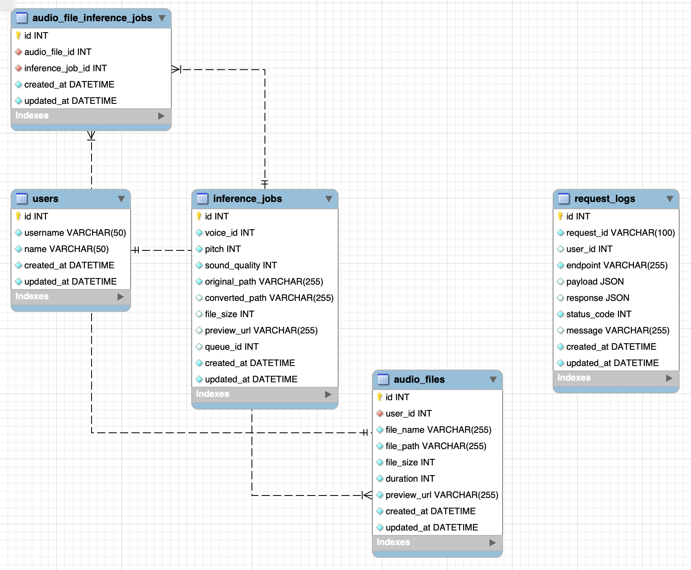

# wavedeck

## 실행 방법

---

1. docker-compose 실행

```bash
docker-compose up -d
```

2. DB 스키마 생성 스크립트 실행

```bash
npm run migration:run
```

3. DB 시드 데이터 추가

```bash
npm run migration:seed
```

---

### DB 접속 정보

---

-   호스트: `localhost`
-   포트: `3306`
-   사용자 이름: `pung`
-   비밀번호: `pungPassword!23`
-   데이터베이스: `wavedeck`

---

# 데이터베이스 테이블

## 

## `users`

`users` 테이블은 사용자 정보를 저장합니다.
기존에 있다고 가정하고, 간략화했습니다.

### 컬럼

-   **id**: `int` (기본 키) - 사용자 고유번호.
-   **username**: `varchar(50)` - 사용자 계정명.
-   **name**: `varchar(50)` - 사용자 이름.
-   **created_at**: `datetime` - 사용자 계정 생성 시각.
-   **updated_at**: `datetime` - 마지막 업데이트 시각.

### 관계

-   **audio_files**: `AudioFile` 일대다 관계.

---

## `audio_files`

`audio_files` 테이블은 사용자가 업로드한 오디오 파일 정보를 저장합니다.

### 컬럼

-   **id**: `int` (기본 키) - 오디오 파일 고유번호.
-   **user_id**: `int` - 오디오 파일을 업로드한 사용자의 고유번호.
-   **file_name**: `varchar` - 파일명.
-   **file_path**: `varchar` - 파일 경로.
-   **file_size**: `int` - 파일 크기 (bytes).
-   **duration**: `int` - 파일 길이 (초 단위).
-   **preview_url**: `varchar` - 미리보기 URL.
-   **created_at**: `datetime` - 파일이 업로드된 시각.
-   **updated_at**: `datetime` - 마지막 업데이트된 시각.

### 관계

-   **users**: `User` 다대일 관계.
-   **audio_file_inference_jobs**: `AudioFileInferenceJob` 일대다 관계.

---

## `audio_file_inference_jobs`

`audio_file_inference_jobs` 테이블은 오디오 파일과 AI 변환 작업 간의 관계를 저장합니다.

### 컬럼

-   **id**: `int` (기본 키) - 고유번호.
-   **audio_file_id**: `int` - 오디오 파일의 고유번호.
-   **inference_job_id**: `int` - 변환 작업의 고유번호.
-   **created_at**: `datetime` - 생성된 시각.
-   **updated_at**: `datetime` - 마지막 업데이트된 시각.

### 관계

-   **audio_files**: `AudioFile` 다대일 관계.
-   **inference_jobs**: `InferenceJob` 다대일 관계.

---

## `inference_jobs`

`inference_jobs` 테이블은 오디오 파일에 대한 AI 변환 작업을 저장합니다.

### 컬럼

-   **id**: `int` (기본 키) - 변환 작업 고유번호.
-   **voice_id**: `int` - 음성 모델의 고유번호.
-   **pitch**: `int` - 피치 조정 값 (기본값: 0).
-   **sound_quality**: `int` - 음질 조정 값 (기본값: 0).
-   **original_path**: `varchar` - 원본 파일 경로.
-   **converted_path**: `varchar | null` - 변환된 파일 경로.
-   **file_size**: `int | null` - 파일 크기 (bytes).
-   **preview_url**: `varchar | null` - 미리보기 URL.
-   **queue_id**: `int | null` - 비동기 큐 ID.
-   **created_at**: `datetime` - 생성된 시각.
-   **updated_at**: `datetime` - 마지막 업데이트된 시각.

### 관계

-   **audio_file_inference_jobs**: `AudioFileInferenceJob` 일대다 관계.

---

## 프로젝트 디렉토리 구조

---

```
src/
│
├── abstracts/                          # 추상 클래스 모음
├── interfaces/                         # 인터페이스 모음
├── middlewares/                        # 미들웨어 관련 파일
├── modules/                            # 주요 도메인 모듈
│   ├── inference-job/                  # AI 변환 관련 모듈
│   ├── audio-file/                     # 오디오 파일 처리 모듈
│   │   ├── dtos/                        # DTO 관련 폴더
│   │   │   ├── inputs/                  # 입력 DTO (Request Body)
│   │   │   ├── outputs/                 # 출력 DTO (Response)
│   │   │   └── queries/                 # 쿼리 파라미터 DTO
│   │   ├── models/                      # 데이터 모델 정의
│   │   ├── audio-file.controller.ts     # 컨트롤러
│   │   ├── audio-file.service.ts        # 서비스
│   │   └── audio-file.module.ts         # 모듈
│   │
│   └── other-modules/                   # 기타 모듈들 (예시)
│
├── providers/                           # 프로바이더 (파일업로드, 밸리데이션)
├── types/                               # 타입 관련 정의
│
├── app.container.ts                     # 의존성 주입 컨테이너
├── app.router.ts                        # 라우터 설정
└── main.ts
```

---

## API 문서 안내

---

API 문서는 Swagger를 통해 제공됩니다.

-   **Swagger UI**: [http://localhost:3000/docs](http://localhost:3000/docs)
-   **기능**: API 테스트 가능, 엔드포인트 목록 제공

---
